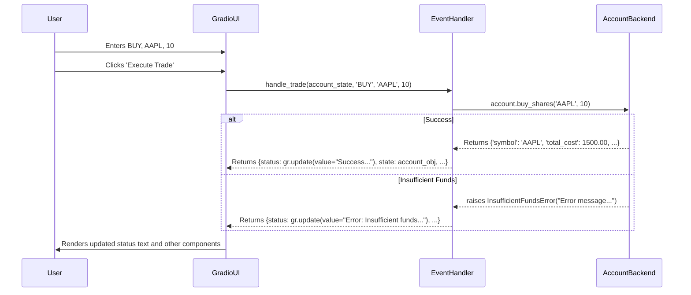

# Technical Design Document: Trading Simulation Platform

## 1. Overview & Architecture

This document outlines the technical design for a simple account management and trading simulation system. The system is architected with a clean separation between the backend business logic (Python) and the frontend user interface (Gradio), ensuring modularity, testability, and clarity of concerns.

### 1.1. Architecture

The application will operate as a single Python process, structured into two distinct layers:

*   **Backend Logic Layer (Python):** A self-contained Python module named `accounts`. This module's primary entry point is the `Account` class, which encapsulates all business logic, data management, and validation for a user's trading account. It is designed to be completely independent of any UI framework, making it easily testable and reusable. It relies on an injectable `price_provider` function for external market data, promoting loose coupling.

*   **Frontend Presentation Layer (Gradio):** A Gradio application that provides the user interface. It is responsible for rendering components, gathering user input, invoking the backend layer via handler functions, and displaying the results—whether data, success messages, or errors—back to the user.

### 1.2. State Management

For this single-user simulation, the application state will be managed within the Gradio application. A single `Account` object instance will be created upon successful account creation and stored in a `gr.State` component. This object will be passed to and updated by the various UI event handlers, ensuring that all operations (deposit, trade, etc.) are performed on the same user account instance throughout the session.

**Scalability Note:** This in-memory `gr.State` management is suitable for a single-user, session-based application. For a multi-user or persistent production environment, this would need to evolve. The `Account` object would be replaced with a database-backed model (e.g., using SQLAlchemy), and the handlers would query and update the database instead of an in-memory object. The backend's design allows for this transition with minimal changes to its public interface.

---

## 2. Python Backend Design

This section details the design of the `accounts` module, which contains all the core business logic.

### 2.1. Module Structure

The backend will be organized to separate concerns clearly:

```
/
├── accounts.py      # Core Account class, data models, and custom exceptions.
├── pricing.py       # Share pricing provider function (external dependency).
└── app.py           # The Gradio application entry point and UI logic.
```

### 2.2. Data Models/Schemas

We will use `typing.TypedDict` to define clear, lightweight data structures for transaction records and reporting summaries. This creates an explicit contract between the backend and any consumer.

```python
# In accounts.py
from typing import TypedDict, Literal, List, Optional
from datetime import datetime

TransactionType = Literal["DEPOSIT", "WITHDRAWAL", "BUY", "SELL"]

class Transaction(TypedDict):
    """Represents a single financial transaction."""
    timestamp: datetime
    type: TransactionType
    symbol: Optional[str]
    quantity: Optional[int]
    price_per_share: Optional[float]
    total_amount: float

class Holding(TypedDict):
    """Represents the quantity of a single stock owned."""
    symbol: str
    quantity: int

class PortfolioSummary(TypedDict):
    """A snapshot of the account's entire value and performance."""
    cash_balance: float
    net_deposits: float
    holdings_with_prices: List[dict] # e.g. [{'symbol': 'AAPL', 'quantity': 10, 'price': 150.0, 'value': 1500.0}]
    total_portfolio_value: float
    total_shares_value: float
    profit_loss: float
```

### 2.3. External Dependency (`pricing.py`)

The `accounts` module will depend on an injectable function to fetch share prices. This isolates the core logic from the specifics of data retrieval.

```python
# In pricing.py
from typing import Optional

def get_share_price(symbol: str) -> Optional[float]:
    """
    Retrieves the current price for a given stock symbol.
    
    This is a test implementation. In a real application, this would
    call an external market data API.

    Args:
        symbol: The stock symbol (e.g., 'AAPL').

    Returns:
        The price as a float, or None if the symbol is not found.
    """
    prices = {
        "AAPL": 150.00,
        "TSLA": 300.00,
        "GOOGL": 2200.00,
    }
    # Case-insensitive and strips whitespace
    return prices.get(symbol.upper().strip())
```

### 2.4. Error Handling Strategy

Custom exceptions are defined to signal specific business rule violations. This allows the Gradio layer to catch specific errors and display precise, user-friendly messages.

```python
# In accounts.py

class AccountError(Exception):
    """Base exception for all account-related errors."""
    pass

class InsufficientFundsError(AccountError):
    """Raised when an operation cannot be completed due to lack of cash."""
    pass

class InsufficientSharesError(AccountError):
    """Raised when trying to sell more shares than owned."""
    pass

class InvalidSymbolError(AccountError):
    """Raised when a stock symbol is not valid or has no price."""
    pass
```

### 2.5. Class Definition: `Account`

This is the primary class containing all business logic, state, and methods for a single user account.

```python
# In accounts.py
from collections import defaultdict
from datetime import datetime
from typing import List, Dict, Callable, Optional

# ... (Import data models and exceptions defined above) ...

class Account:
    """
    Manages a user's trading account, including cash, holdings, and transactions.
    """

    def __init__(self, username: str, initial_deposit: float, price_provider: Callable[[str], Optional[float]]):
        """
        Initializes a new trading account.

        Args:
            username: The user's chosen name.
            initial_deposit: The starting cash balance.
            price_provider: A function that takes a symbol string and returns a price float or None.

        Raises:
            ValueError: If the initial deposit is not a positive number.
        """
        if not isinstance(initial_deposit, (int, float)) or initial_deposit <= 0:
            raise ValueError("Initial deposit must be a positive number.")
        
        self.username: str = username
        self.cash_balance: float = initial_deposit
        self.holdings: Dict[str, int] = defaultdict(int)
        self.transactions: List[Transaction] = []
        self._price_provider: Callable[[str], Optional[float]] = price_provider
        
        self._record_transaction(
            type="DEPOSIT",
            total_amount=initial_deposit
        )

    def deposit(self, amount: float) -> float:
        """
        Adds funds to the account's cash balance.

        Args:
            amount: The amount to deposit.

        Returns:
            The new cash balance after the deposit.

        Raises:
            ValueError: If the amount is not a positive number.
        """
        if not isinstance(amount, (int, float)) or amount <= 0:
            raise ValueError("Amount must be a positive number.")
        self.cash_balance += amount
        self._record_transaction(type="DEPOSIT", total_amount=amount)
        return self.cash_balance

    def withdraw(self, amount: float) -> float:
        """
        Removes funds from the account's cash balance.

        Args:
            amount: The amount to withdraw.

        Returns:
            The new cash balance after the withdrawal.

        Raises:
            ValueError: If the amount is not a positive number.
            InsufficientFundsError: If withdrawal amount exceeds cash balance.
        """
        if not isinstance(amount, (int, float)) or amount <= 0:
            raise ValueError("Amount must be a positive number.")
        if amount > self.cash_balance:
            raise InsufficientFundsError(f"You cannot withdraw more than your available cash balance of ${self.cash_balance:,.2f}.")
        self.cash_balance -= amount
        self._record_transaction(type="WITHDRAWAL", total_amount=amount)
        return self.cash_balance

    def buy_shares(self, symbol: str, quantity: int) -> Dict:
        """
        Purchases shares of a stock, deducting the cost from the cash balance.

        Args:
            symbol: The stock symbol to buy (e.g., 'AAPL').
            quantity: The number of shares to buy.

        Returns:
            A dictionary with details of the successful transaction.

        Raises:
            ValueError: If quantity is not a positive integer.
            InvalidSymbolError: If the symbol is not valid or has no price.
            InsufficientFundsError: If the total cost exceeds the cash balance.
        """
        clean_symbol = symbol.upper().strip()
        if not isinstance(quantity, int) or quantity <= 0:
            raise ValueError("Quantity must be a positive whole number.")
        
        price = self._price_provider(clean_symbol)
        if price is None:
            raise InvalidSymbolError(f"Invalid stock symbol '{clean_symbol}'. Please use a valid symbol (e.g., AAPL, TSLA, GOOGL).")

        total_cost = quantity * price
        if total_cost > self.cash_balance:
            raise InsufficientFundsError(f"You need ${total_cost:,.2f} to buy {quantity} shares of {clean_symbol}, but you only have ${self.cash_balance:,.2f}.")

        self.cash_balance -= total_cost
        self.holdings[clean_symbol] += quantity
        self._record_transaction("BUY", total_cost, symbol=clean_symbol, quantity=quantity, price_per_share=price)
        
        return {
            'symbol': clean_symbol, 'quantity': quantity,
            'price_per_share': price, 'total_cost': total_cost
        }

    def sell_shares(self, symbol: str, quantity: int) -> Dict:
        """
        Sells shares of a stock, adding the proceeds to the cash balance.

        Args:
            symbol: The stock symbol to sell.
            quantity: The number of shares to sell.

        Returns:
            A dictionary with details of the successful transaction.

        Raises:
            ValueError: If quantity is not a positive integer.
            InvalidSymbolError: If the symbol is not valid or has no price.
            InsufficientSharesError: If trying to sell more shares than owned.
        """
        clean_symbol = symbol.upper().strip()
        if not isinstance(quantity, int) or quantity <= 0:
            raise ValueError("Quantity must be a positive whole number.")
        
        owned_quantity = self.holdings.get(clean_symbol, 0)
        if quantity > owned_quantity:
            raise InsufficientSharesError(f"You cannot sell {quantity} shares of {clean_symbol} as you only own {owned_quantity}.")

        price = self._price_provider(clean_symbol)
        if price is None:
            raise InvalidSymbolError(f"Invalid stock symbol '{clean_symbol}'. Please use a valid symbol (e.g., AAPL, TSLA, GOOGL).")

        total_proceeds = quantity * price
        self.cash_balance += total_proceeds
        self.holdings[clean_symbol] -= quantity
        if self.holdings[clean_symbol] == 0:
            del self.holdings[clean_symbol]
        
        self._record_transaction("SELL", total_proceeds, symbol=clean_symbol, quantity=quantity, price_per_share=price)

        return {
            'symbol': clean_symbol, 'quantity': quantity,
            'price_per_share': price, 'total_proceeds': total_proceeds
        }

    def get_portfolio_summary(self) -> PortfolioSummary:
        """
        Calculates a full summary of the account's current state and performance.

        Returns:
            A PortfolioSummary TypedDict with all calculated values.
        """
        total_shares_value = 0.0
        holdings_with_prices = []
        for symbol, quantity in self.holdings.items():
            price = self._price_provider(symbol) or 0.0
            value = quantity * price
            total_shares_value += value
            holdings_with_prices.append({
                "symbol": symbol, "quantity": quantity,
                "price": price, "value": value
            })

        net_deposits = sum(tx['total_amount'] for tx in self.transactions if tx['type'] == 'DEPOSIT') - \
                       sum(tx['total_amount'] for tx in self.transactions if tx['type'] == 'WITHDRAWAL')

        total_portfolio_value = self.cash_balance + total_shares_value
        profit_loss = total_portfolio_value - net_deposits

        return {
            "cash_balance": self.cash_balance,
            "net_deposits": net_deposits,
            "holdings_with_prices": holdings_with_prices,
            "total_portfolio_value": total_portfolio_value,
            "total_shares_value": total_shares_value,
            "profit_loss": profit_loss
        }

    def get_transaction_history(self) -> List[Transaction]:
        """
        Retrieves the full list of transactions for the account.

        Returns:
            A list of Transaction objects, sorted from most to least recent.
        """
        return sorted(self.transactions, key=lambda tx: tx['timestamp'], reverse=True)

    def _record_transaction(self, type: TransactionType, total_amount: float, symbol: Optional[str] = None, quantity: Optional[int] = None, price_per_share: Optional[float] = None):
        """A private helper to log a transaction."""
        transaction: Transaction = {
            "timestamp": datetime.now(),
            "type": type,
            "symbol": symbol,
            "quantity": quantity,
            "price_per_share": price_per_share,
            "total_amount": total_amount
        }
        self.transactions.append(transaction)
```

---

## 3. Gradio Frontend Design

This section specifies the UI layout, components, and user interaction flows.

### 3.1. UI Component Mapping

| User Action / Story | Backend Method Call | Gradio Inputs | Gradio Trigger | Gradio Outputs Updated |
| :--- | :--- | :--- | :--- | :--- |
| **US-001:** Create Account | `Account(...)` (constructor) | `gr.Textbox(label="Username")`, `gr.Textbox(label="Password")`, `gr.Number(label="Initial Deposit...")` | `gr.Button("Create Account")` | `gr.Textbox(label="Status")`, `gr.State`, `gr.Row` (creation UI), `gr.Tabs` (main UI) |
| **US-002:** Deposit | `account.deposit()` | `gr.Number(label="Amount ($)")` | `gr.Button("Deposit")` | `gr.Textbox(label="Status")`, `gr.Textbox` (cash balances), `gr.State` |
| **US-002:** Withdraw | `account.withdraw()` | `gr.Number(label="Amount ($)")` | `gr.Button("Withdraw")` | `gr.Textbox(label="Status")`, `gr.Textbox` (cash balances), `gr.State` |
| **US-003:** Trade Shares | `account.buy/sell_shares()` | `gr.Dropdown(...)`, `gr.Textbox(label="Stock Symbol")`, `gr.Number(label="Quantity")` | `gr.Button("Execute Trade")` | `gr.Textbox(label="Status")`, `gr.State` |
| **US-004:** View Portfolio | `account.get_portfolio_summary()` | (None) | `gr.Button("Refresh")` or `gr.Tab("Portfolio").select()` | `gr.Textbox` (Value, P/L, Cash), `gr.Dataframe` (Holdings) |
| **US-004:** View History | `account.get_transaction_history()` | (None) | `gr.Tab("History").select()` | `gr.Dataframe` (History) |

### 3.2. User-Facing Messages

#### Success Messages
*   **Account Creation:** `Success: Account '{username}' created with an initial deposit of ${amount:,.2f}.`
*   **Deposit:** `Success: ${amount:,.2f} deposited. Your new cash balance is ${new_balance:,.2f}.`
*   **Withdrawal:** `Success: ${amount:,.2f} withdrawn. Your new cash balance is ${new_balance:,.2f}.`
*   **Buy Shares:** `Success: Bought {quantity} shares of {symbol} at ${price:,.2f} each for a total of ${total:,.2f}.`
*   **Sell Shares:** `Success: Sold {quantity} shares of {symbol} at ${price:,.2f} each for a total of ${total:,.2f}.`

#### Error Messages
*   **Account Creation (Invalid Deposit):** `Error: Initial deposit must be a positive number.`
*   **Cash Management (Invalid Amount):** `Error: Amount must be a positive number.`
*   **Withdrawal (Insufficient Funds):** (Message generated by backend) `Error: Insufficient funds. You cannot withdraw more than your available cash balance of ${balance:,.2f}.`
*   **Buy Shares (Insufficient Funds):** (Message generated by backend) `Error: Insufficient funds. You need ${required:,.2f} to buy {quantity} shares of {symbol}, but you only have ${balance:,.2f}.`
*   **Sell Shares (Insufficient Shares):** (Message generated by backend) `Error: Insufficient shares. You cannot sell {quantity} shares of {symbol} as you only own {owned}.`
*   **Trading (Invalid Symbol):** (Message generated by backend) `Error: Invalid stock symbol '{symbol}'. Please use a valid symbol (e.g., AAPL, TSLA, GOOGL).`
*   **Trading (Invalid Quantity):** `Error: Quantity must be a positive whole number.`
*   **Account Creation (Username Taken):** `Error: Username '{username}' is already taken. Please choose a different username.` (Note: This logic is outside the `Account` class and would be handled in the Gradio app's user management layer, which is currently out of scope).

### 3.3. UI Layout & Workflow

The UI will have a two-stage workflow managed by component visibility.

1.  **Stage 1: Account Creation View (Visible by default)**
    *   `gr.Blocks` containing a `gr.Row(visible=True, elem_id="creation_view")`
        *   `gr.Textbox(label="Username")`
        *   `gr.Textbox(label="Password", type="password")` (Note: Authentication is out of scope, but the field is included per US-001).
        *   `gr.Number(label="Initial Deposit Amount ($)", value=10000.00, minimum=0.01)`
        *   `gr.Button("Create Account")`
        *   `gr.Textbox(label="Status", interactive=False, elem_id="creation_status")`

2.  **Workflow:**
    *   User fills details and clicks "Create Account".
    *   **On Success:** The handler function returns `gr.update(visible=False)` for the creation `gr.Row` and `gr.update(visible=True)` for the main dashboard `gr.Tabs`. The `Account` object is stored in `gr.State`.
    *   **On Failure:** An error message is shown in the creation status box. The UI remains in Stage 1.

3.  **Stage 2: Main Dashboard (Initially `visible=False`)**
    *   `gr.State()` to hold the `Account` instance.
    *   `gr.Tabs(visible=False, elem_id="main_dashboard")`:
        *   **Tab 1: "Portfolio"**
            *   `gr.Button("Refresh")`
            *   `gr.Textbox(label="Total Portfolio Value ($)", interactive=False)`
            *   `gr.Textbox(label="Total Profit / Loss ($)", interactive=False)`
            *   `gr.Textbox(label="Cash Balance ($)", interactive=False)`
            *   `gr.Dataframe(label="Current Holdings", headers=["Symbol", "Quantity", "Current Price", "Total Value"], datatype=["str", "number", "number", "number"])`
        *   **Tab 2: "Cash Management"**
            *   `gr.Textbox(label="Current Cash Balance", interactive=False)`
            *   `gr.Number(label="Amount ($)", minimum=0.01)`
            *   `gr.Row` with `gr.Button("Deposit")` and `gr.Button("Withdraw")`
            *   `gr.Textbox(label="Status", interactive=False)`
        *   **Tab 3: "Trade"**
            *   `gr.Dropdown(label="Action", choices=["BUY", "SELL"], value="BUY")`
            *   `gr.Textbox(label="Stock Symbol (e.g., AAPL)")`
            *   `gr.Number(label="Quantity", minimum=1, precision=0, value=1)`
            *   `gr.Button("Execute Trade")`
            *   `gr.Textbox(label="Status", interactive=False)`
        *   **Tab 4: "History"**
            *   `gr.Dataframe(label="Transaction History", headers=["Timestamp", "Type", "Symbol", "Quantity", "Price", "Total"], datatype=["str", "str", "str", "number", "number", "number"])`

### 3.4. Input Validation & Error Display

*   **Client-Side (Gradio):** Basic validation via component properties (e.g., `minimum=1`, `precision=0` on `gr.Number`) provides immediate feedback.
*   **Server-Side (Backend):** The `Account` class is the source of truth for all business rules. Its methods perform critical validation (checking funds, share counts, etc.) and raise specific, descriptive exceptions.
*   **Error Display:** All error messages, whether from frontend validation logic or caught from backend exceptions, will be displayed in the dedicated `gr.Textbox(label="Status")` component on the relevant tab.

---

## 4. Integration Points

### 4.1. Backend-Frontend Communication

Communication is managed by Python functions that serve as Gradio event handlers. These functions are the "glue" that connects UI actions to backend logic.

**The standard pattern for a handler function:**
1.  The function is triggered by a Gradio event (e.g., `button.click()`).
2.  It receives the `gr.State` (the `Account` object) and values from input components as arguments.
3.  It wraps the call to the corresponding `Account` method in a `try...except` block.
4.  **`try` block (Success Path):**
    *   It calls the `Account` method (e.g., `account.buy_shares(...)`).
    *   It formats a user-facing success message using the data returned from the method.
    *   It constructs and returns a dictionary of `gr.update()` objects to refresh all relevant UI components (status box, balance display, dataframes) and, crucially, to pass the modified `Account` object back into the `gr.State`.
5.  **`except` block (Error Path):**
    *   It catches specific exceptions (`InsufficientFundsError`, `ValueError`, etc.).
    *   The exception's message, which is already user-friendly, is used as the status update.
    *   It returns a `gr.update()` only for the status component. The `gr.State` is not modified, preserving the pre-error state.

### 4.2. Data Flow Diagram (Trade Execution)



### 4.3. Message Mapping (User Story ACs → UI Elements)

| User Story / AC | Triggering Condition | Backend Logic / Exception | User-Facing Message (Displayed in relevant `gr.Textbox(label="Status")`) |
| :--- | :--- | :--- | :--- |
| US-001 / AC-1 | Successful account creation | `Account()` constructor succeeds | `Success: Account '{username}' created with an initial deposit of ${amount:,.2f}.` |
| US-001 / AC-3 | Create with deposit <= 0 | `Account()` constructor raises `ValueError` | `Error: Initial deposit must be a positive number.` |
| US-002 / AC-1 | Successful deposit | `account.deposit()` succeeds | `Success: ${amount:,.2f} deposited. Your new cash balance is ${new_balance:,.2f}.` |
| US-002 / AC-3 | Withdraw > Balance | `account.withdraw()` raises `InsufficientFundsError` | `Error: Insufficient funds. You cannot withdraw more than your available cash balance of ${balance:,.2f}.` |
| US-002 / AC-4 | Deposit/Withdraw <= 0 | `account.deposit/withdraw()` raises `ValueError` | `Error: Amount must be a positive number.` |
| US-003 / AC-1 | Successful buy | `account.buy_shares()` succeeds | `Success: Bought {quantity} shares of {symbol} at ${price:,.2f} each for a total of ${total:,.2f}.` |
| US-003 / AC-3 | Buy cost > Balance | `account.buy_shares()` raises `InsufficientFundsError` | `Error: Insufficient funds. You need ${required:,.2f} to buy {quantity} shares of {symbol}, but you only have ${balance:,.2f}.` |
| US-003 / AC-4 | Sell > Owned shares | `account.sell_shares()` raises `InsufficientSharesError` | `Error: Insufficient shares. You cannot sell {quantity} shares of {symbol} as you only own {owned}.` |
| US-003 / AC-5 | Invalid ticker symbol | `account.buy/sell_shares()` raises `InvalidSymbolError` | `Error: Invalid stock symbol '{symbol}'. Please use a valid symbol (e.g., AAPL, TSLA, GOOGL).` |
| US-003 / AC-6 | Trade quantity <= 0 | `account.buy/sell_shares()` raises `ValueError` | `Error: Quantity must be a positive whole number.` |

---

## 5. Implementation Examples

### 5.1. Backend Usage Example (for testing)

This can be placed inside an `if __name__ == '__main__':` block in `accounts.py` for quick verification.

```python
# In accounts.py

if __name__ == '__main__':
    from pricing import get_share_price

    try:
        # US-001: Create account
        my_account = Account(username='trader123', initial_deposit=10000.00, price_provider=get_share_price)
        print(f"Account created. Balance: ${my_account.cash_balance:,.2f}")

        # US-002: Deposit
        my_account.deposit(2000)
        print(f"Deposited. New Balance: ${my_account.cash_balance:,.2f}")

        # US-003: Buy shares
        buy_result = my_account.buy_shares('AAPL', 10)
        print(f"Bought shares. Cost: ${buy_result['total_cost']}. Balance: ${my_account.cash_balance:,.2f}")

        # US-004: View Portfolio
        summary = my_account.get_portfolio_summary()
        print(f"Portfolio Value: ${summary['total_portfolio_value']:,.2f}, P/L: ${summary['profit_loss']:,.2f}")
        
        # US-003: Attempt invalid sell
        my_account.sell_shares('TSLA', 5)

    except (AccountError, ValueError) as e:
        print(f"\nAN EXPECTED ERROR OCCURRED:\n  {e}")
```

### 5.2. Frontend Integration Example (Gradio Handler)

This demonstrates the "glue code" pattern for the "Execute Trade" button.

```python
# In app.py
import gradio as gr
from accounts import Account, AccountError
from pricing import get_share_price

# Assume all Gradio components are defined, e.g., trade_status_box, account_state, etc.

def handle_trade(account: Account, action: str, symbol: str, quantity: int):
    """Event handler for the 'Execute Trade' button."""
    # Pre-flight check for active account and valid inputs
    if not isinstance(account, Account):
        return {trade_status_box: "Error: No active account. Please create one first."}
    if not (symbol and quantity):
        return {trade_status_box: "Error: Stock Symbol and Quantity are required."}

    try:
        # Call the appropriate backend method
        if action == "BUY":
            result = account.buy_shares(symbol, int(quantity))
            msg = (f"Success: Bought {quantity} shares of {result['symbol']} "
                   f"at ${result['price_per_share']:,.2f} each for a total of ${result['total_cost']:,.2f}.")
        else: # SELL
            result = account.sell_shares(symbol, int(quantity))
            msg = (f"Success: Sold {quantity} shares of {result['symbol']} "
                   f"at ${result['price_per_share']:,.2f} each for a total of ${result['total_proceeds']:,.2f}.")

        # On success, update status, and return the modified account object to the state
        return {
            trade_status_box: msg,
            account_state: account
        }

    except (AccountError, ValueError) as e:
        # On failure, display the error and return the UNMODIFIED account state
        return {
            trade_status_box: f"Error: {e}",
            account_state: account
        }

# In the gr.Blocks() context:
# trade_button.click(
#     fn=handle_trade,
#     inputs=[account_state, trade_action_dd, trade_symbol_tb, trade_quantity_num],
#     outputs=[trade_status_box, account_state]
# ).then(
#     fn=refresh_portfolio_view, # A function that calls get_portfolio_summary
#     inputs=[account_state],
#     outputs=[portfolio_value_tb, portfolio_pl_tb, ...]
# )
```

---

## 6. Testing & QA Guidelines

### 6.1. Backend (Unit Testing)

Backend developers must write automated tests for `accounts.py` using `pytest`. A mock `price_provider` must be used to ensure tests are deterministic and fast.

**Key Test Cases:**
*   `test_account_creation_success`: Verify initial balance, username, and initial DEPOSIT transaction.
*   `test_account_creation_invalid_deposit`: Assert `pytest.raises(ValueError)` for negative or zero deposit.
*   `test_deposit_and_withdraw_success`: Check balance updates correctly and transactions are logged.
*   `test_withdraw_insufficient_funds`: Assert `pytest.raises(InsufficientFundsError)`.
*   `test_buy_shares_success`: Verify cash deduction, holdings update, and transaction log.
*   `test_buy_shares_insufficient_funds`: Assert `pytest.raises(InsufficientFundsError)`.
*   `test_sell_shares_success`: Verify cash increase, holdings update, and transaction log.
*   `test_sell_shares_insufficient_shares`: Assert `pytest.raises(InsufficientSharesError)`.
*   `test_trade_invalid_symbol`: Assert `pytest.raises(InvalidSymbolError)` for a non-existent ticker.
*   `test_get_portfolio_summary_calculations`: Verify P/L, net deposits, and total value are arithmetically correct across multiple transactions.
*   `test_transaction_history_order`: Ensure `get_transaction_history` returns transactions in reverse chronological order.

### 6.2. Frontend & End-to-End (E2E) Testing

QA will manually execute test scripts based directly on the user stories' acceptance criteria.

**QA Validation Checklist:**
1.  **US-001: Account Creation**
    *   [ ] **AC-1:** Create an account with valid inputs. Verify the success message matches the spec and the main dashboard becomes visible.
    *   [ ] **AC-3:** Attempt to create an account with a deposit of `0` or `-100`. Verify the error message `Error: Initial deposit must be a positive number.` is displayed.
2.  **US-002: Cash Management**
    *   [ ] **AC-1:** On the "Cash Management" tab, deposit $500. Verify the success message and that the "Current Cash Balance" field updates.
    *   [ ] **AC-2:** Withdraw $100. Verify success message and balance update.
    *   [ ] **AC-3:** Attempt to withdraw more than the available balance. Verify the exact error message from the backend is displayed.
3.  **US-003: Trading**
    *   [ ] **AC-1:** On the "Trade" tab, execute a valid BUY order for 10 AAPL. Verify the success message.
    *   [ ] **AC-2:** Execute a valid SELL order for 5 AAPL. Verify the success message.
    *   [ ] **AC-3:** Attempt to buy shares that cost more than the cash balance. Verify the exact error message is displayed.
    *   [ ] **AC-4:** Attempt to sell more shares of a stock than are owned. Verify the exact error message is displayed.
    *   [ ] **AC-5:** Attempt to trade symbol 'XYZ'. Verify the exact error message is displayed.
4.  **US-004: Reporting**
    *   [ ] **AC-1:** After making trades, navigate to the "Portfolio" tab and click "Refresh". Manually calculate and verify that all displayed values (Total Portfolio Value, P/L, Cash, Holdings table) are correct.
    *   [ ] **AC-2:** Navigate to the "History" tab. Verify all executed transactions (initial deposit, deposit, buy, sell) are listed correctly and in reverse chronological order.
    *   [ ] **AC-3:** After creating a new account, immediately check the Portfolio and History tabs to ensure they show the correct initial state (P/L is $0, only one deposit transaction).