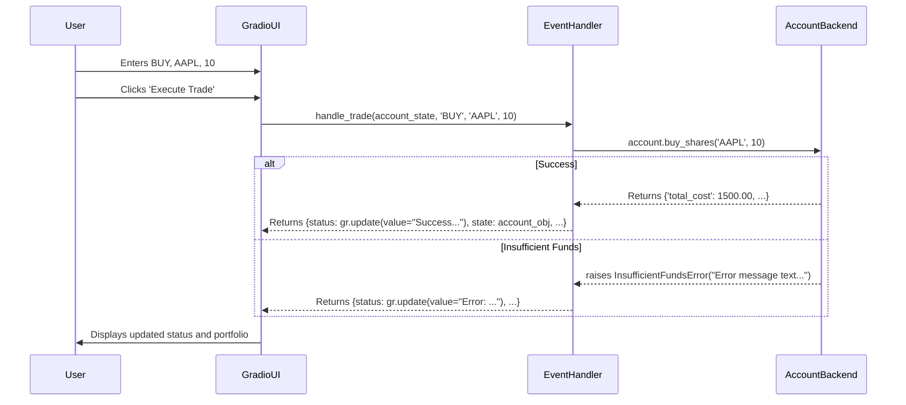

# Technical Design Document: Trading Simulation Platform

## 1. Overview & Architecture

This document outlines the technical design for a simple account management and trading simulation system. The system is architected with a clean separation between the backend business logic (Python) and the frontend user interface (Gradio).

### 1.1. Architecture

The application will run as a single Python process. The architecture consists of two primary layers:

*   **Backend Logic Layer (Python):** A self-contained Python module named `accounts`. This module contains the `Account` class, which encapsulates all business logic, data management, and validation for a user's trading account. It is designed to be completely independent of the UI, making it easily testable and reusable. It depends on an injectable `price_provider` function for external data.
*   **Frontend Presentation Layer (Gradio):** A Gradio application that provides the user interface. It is responsible for gathering user input, calling the backend layer, and displaying the results (data, success messages, or errors) back to the user.

### 1.2. State Management

The Gradio application will maintain the state of the user's session. A single `Account` object instance will be created upon successful account creation and stored in a `gr.State` component. This object will be passed to and updated by the various UI event handlers, ensuring that all operations (deposit, trade, etc.) are performed on the same user account throughout the session.

---

## 2. Python Backend Design

This section details the design of the `accounts` module, which contains all the core business logic.

### 2.1. Module Structure

The backend will be organized into two files to separate concerns:

```
/
├── accounts.py      # Core Account class, data models, and exceptions
├── pricing.py       # Share pricing provider function
└── app.py           # The Gradio application entry point
```

### 2.2. Data Models/Schemas

We will use `typing.TypedDict` and `typing.Literal` to define clear, lightweight data structures for communication and internal state.

```python
# In accounts.py
from typing import TypedDict, Literal, List, Optional
from datetime import datetime

TransactionType = Literal["DEPOSIT", "WITHDRAWAL", "BUY", "SELL"]

class Transaction(TypedDict):
    """Represents a single financial transaction."""
    timestamp: datetime
    type: TransactionType
    symbol: Optional[str]
    quantity: Optional[int]
    price_per_share: Optional[float]
    total_amount: float

class Holding(TypedDict):
    """Represents the quantity of a single stock owned."""
    symbol: str
    quantity: int

class PortfolioSummary(TypedDict):
    """A snapshot of the account's entire value and performance."""
    cash_balance: float
    net_deposits: float
    holdings: List[Holding]
    total_portfolio_value: float
    total_shares_value: float
    profit_loss: float
```

### 2.3. External Dependencies (`pricing.py`)

The `accounts` module will depend on an injectable function to get share prices. This promotes testability.

```python
# In pricing.py
from typing import Optional

def get_share_price(symbol: str) -> Optional[float]:
    """
    Retrieves the current price for a given stock symbol.
    
    This is a test implementation. In a real application, this would
    call an external market data API.

    Args:
        symbol: The stock symbol (e.g., 'AAPL').

    Returns:
        The price as a float, or None if the symbol is not found.
    """
    prices = {
        "AAPL": 150.00,
        "TSLA": 300.00,
        "GOOGL": 2200.00,
    }
    return prices.get(symbol.upper().strip())
```

### 2.4. Error Handling Strategy

Custom exceptions will be used to signal specific business rule violations. This allows the calling layer (Gradio UI) to catch specific errors and display appropriate user-facing messages.

```python
# In accounts.py

class AccountError(Exception):
    """Base exception for all account-related errors."""
    pass

class InsufficientFundsError(AccountError):
    """Raised when an operation cannot be completed due to lack of cash."""
    pass

class InsufficientSharesError(AccountError):
    """Raised when trying to sell more shares than owned."""
    pass

class InvalidSymbolError(AccountError):
    """Raised when a stock symbol is not valid or has no price."""
    pass
```

### 2.5. Class Definition: `Account`

This is the primary class containing all business logic. Note that user authentication (username/password checking) is out of scope for this class; it assumes a unique username is provided.

```python
# In accounts.py
from collections import defaultdict
from datetime import datetime
from typing import List, Dict, Callable, Optional

# Import data models and exceptions defined above

class Account:
    """
    Manages a user's trading account, including cash, holdings, and transactions.
    """
    def __init__(self, username: str, initial_deposit: float, price_provider: Callable[[str], Optional[float]]):
        """
        Initializes a new trading account.

        Args:
            username: The user's chosen name.
            initial_deposit: The starting cash balance.
            price_provider: A function that takes a symbol string and returns a price float or None.

        Raises:
            ValueError: If the initial deposit is not a positive number.
        """
        if not isinstance(initial_deposit, (int, float)) or initial_deposit <= 0:
            raise ValueError("Initial deposit must be a positive number.")
        
        self.username: str = username
        self.cash_balance: float = initial_deposit
        self.holdings: Dict[str, int] = defaultdict(int)
        self.transactions: List[Transaction] = []
        self._price_provider: Callable[[str], Optional[float]] = price_provider
        
        self._record_transaction(
            type="DEPOSIT",
            total_amount=initial_deposit
        )

    def deposit(self, amount: float) -> float:
        """
        Adds funds to the account's cash balance.

        Args:
            amount: The amount to deposit.

        Returns:
            The new cash balance after the deposit.

        Raises:
            ValueError: If the amount is not a positive number.
        """
        if not isinstance(amount, (int, float)) or amount <= 0:
            raise ValueError("Amount must be a positive number.")
        
        self.cash_balance += amount
        self._record_transaction(type="DEPOSIT", total_amount=amount)
        return self.cash_balance

    def withdraw(self, amount: float) -> float:
        """
        Removes funds from the account's cash balance.

        Args:
            amount: The amount to withdraw.

        Returns:
            The new cash balance after the withdrawal.

        Raises:
            ValueError: If the amount is not a positive number.
            InsufficientFundsError: If withdrawal amount exceeds cash balance.
        """
        if not isinstance(amount, (int, float)) or amount <= 0:
            raise ValueError("Amount must be a positive number.")
        if amount > self.cash_balance:
            raise InsufficientFundsError(f"You cannot withdraw more than your available cash balance of ${self.cash_balance:,.2f}.")
        
        self.cash_balance -= amount
        self._record_transaction(type="WITHDRAWAL", total_amount=amount)
        return self.cash_balance

    def buy_shares(self, symbol: str, quantity: int) -> Dict:
        """
        Purchases shares of a stock, deducting the cost from the cash balance.

        Args:
            symbol: The stock symbol to buy (e.g., 'AAPL').
            quantity: The number of shares to buy.

        Returns:
            A dictionary with details of the successful transaction:
            {'symbol': str, 'quantity': int, 'price_per_share': float, 'total_cost': float}

        Raises:
            ValueError: If quantity is not a positive integer.
            InvalidSymbolError: If the symbol is not valid or has no price.
            InsufficientFundsError: If the total cost exceeds the cash balance.
        """
        if not isinstance(quantity, int) or quantity <= 0:
            raise ValueError("Quantity must be a positive whole number.")
        
        clean_symbol = symbol.upper().strip()
        price = self._price_provider(clean_symbol)
        if price is None:
            raise InvalidSymbolError(f"Invalid stock symbol '{symbol}'. Please use a valid symbol (e.g., AAPL, TSLA, GOOGL).")
            
        total_cost = quantity * price
        if total_cost > self.cash_balance:
            raise InsufficientFundsError(f"You need ${total_cost:,.2f} to buy {quantity} shares of {clean_symbol}, but you only have ${self.cash_balance:,.2f}.")
            
        self.cash_balance -= total_cost
        self.holdings[clean_symbol] += quantity
        self._record_transaction(
            type="BUY",
            symbol=clean_symbol,
            quantity=quantity,
            price_per_share=price,
            total_amount=total_cost
        )
        return {'symbol': clean_symbol, 'quantity': quantity, 'price_per_share': price, 'total_cost': total_cost}

    def sell_shares(self, symbol: str, quantity: int) -> Dict:
        """
        Sells shares of a stock, adding the proceeds to the cash balance.

        Args:
            symbol: The stock symbol to sell.
            quantity: The number of shares to sell.

        Returns:
            A dictionary with details of the successful transaction:
            {'symbol': str, 'quantity': int, 'price_per_share': float, 'total_proceeds': float}

        Raises:
            ValueError: If quantity is not a positive integer.
            InvalidSymbolError: If the symbol is not valid or has no price.
            InsufficientSharesError: If trying to sell more shares than owned.
        """
        if not isinstance(quantity, int) or quantity <= 0:
            raise ValueError("Quantity must be a positive whole number.")
        
        clean_symbol = symbol.upper().strip()
        owned_quantity = self.holdings.get(clean_symbol, 0)
        if quantity > owned_quantity:
            raise InsufficientSharesError(f"You cannot sell {quantity} shares of {clean_symbol} as you only own {owned_quantity}.")
            
        price = self._price_provider(clean_symbol)
        if price is None:
            raise InvalidSymbolError(f"Invalid stock symbol '{symbol}'. Please use a valid symbol (e.g., AAPL, TSLA, GOOGL).")
            
        total_proceeds = quantity * price
        self.cash_balance += total_proceeds
        self.holdings[clean_symbol] -= quantity
        if self.holdings[clean_symbol] == 0:
            del self.holdings[clean_symbol]
            
        self._record_transaction(
            type="SELL",
            symbol=clean_symbol,
            quantity=quantity,
            price_per_share=price,
            total_amount=total_proceeds
        )
        return {'symbol': clean_symbol, 'quantity': quantity, 'price_per_share': price, 'total_proceeds': total_proceeds}

    def get_portfolio_summary(self) -> PortfolioSummary:
        """
        Calculates a full summary of the account's current state and performance.

        Returns:
            A PortfolioSummary TypedDict with all calculated values.
        """
        total_shares_value = 0.0
        holdings_list: List[Holding] = []
        for symbol, quantity in self.holdings.items():
            price = self._price_provider(symbol)
            if price is not None:
                total_shares_value += quantity * price
            holdings_list.append({"symbol": symbol, "quantity": quantity})
            
        total_portfolio_value = self.cash_balance + total_shares_value
        
        net_deposits = sum(t['total_amount'] for t in self.transactions if t['type'] == 'DEPOSIT') - \
                       sum(t['total_amount'] for t in self.transactions if t['type'] == 'WITHDRAWAL')
                       
        profit_loss = total_portfolio_value - net_deposits
        
        return {
            "cash_balance": self.cash_balance,
            "net_deposits": net_deposits,
            "holdings": holdings_list,
            "total_portfolio_value": total_portfolio_value,
            "total_shares_value": total_shares_value,
            "profit_loss": profit_loss
        }

    def get_transaction_history(self) -> List[Transaction]:
        """
        Retrieves the full list of transactions for the account.

        Returns:
            A list of Transaction objects, sorted from most to least recent.
        """
        return sorted(self.transactions, key=lambda t: t['timestamp'], reverse=True)
    
    def _record_transaction(self, type: TransactionType, total_amount: float, symbol: Optional[str] = None, quantity: Optional[int] = None, price_per_share: Optional[float] = None):
        """Internal helper to log a transaction."""
        transaction: Transaction = {
            "timestamp": datetime.now(),
            "type": type,
            "symbol": symbol,
            "quantity": quantity,
            "price_per_share": price_per_share,
            "total_amount": total_amount
        }
        self.transactions.append(transaction)
```

---

## 3. Gradio Frontend Design

This section specifies the UI layout, components, and user interaction flows.

### 3.1. UI Component Mapping

| User Action / Story | Backend Method | Gradio Inputs | Gradio Trigger | Gradio Outputs |
| :--- | :--- | :--- | :--- | :--- |
| **US-001:** Create Account | `Account(...)` (constructor) | `gr.Textbox(label="Username")`, `gr.Textbox(label="Password")`, `gr.Number(label="Initial Deposit...")` | `gr.Button("Create Account")` | `gr.Textbox(label="Status")`, `gr.State` |
| **US-002:** Deposit | `account.deposit()` | `gr.Number(label="Amount ($)")` | `gr.Button("Deposit")` | `gr.Textbox(label="Status")`, `gr.Textbox(label="Current Cash Balance")` |
| **US-002:** Withdraw | `account.withdraw()` | `gr.Number(label="Amount ($)")` | `gr.Button("Withdraw")` | `gr.Textbox(label="Status")`, `gr.Textbox(label="Current Cash Balance")` |
| **US-003:** Trade Shares | `account.buy_shares()` / `account.sell_shares()` | `gr.Dropdown(choices=["BUY", "SELL"])`, `gr.Textbox(label="Stock Symbol")`, `gr.Number(label="Quantity")` | `gr.Button("Execute Trade")` | `gr.Textbox(label="Status")` |
| **US-004:** View Portfolio | `account.get_portfolio_summary()` | (None) | `gr.Button("Refresh")` or tab selection | `gr.Textbox` (Value, P/L, Cash), `gr.Dataframe` (Holdings) |
| **US-004:** View History | `account.get_transaction_history()` | (None) | `gr.Tab("History").select()` event | `gr.Dataframe` (History) |

### 3.2. User-Facing Messages

#### Success Messages
*   **Account Creation (US-001):** `Success: Account '{username}' created with an initial deposit of ${amount:,.2f}.`
*   **Deposit (US-002):** `Success: ${amount:,.2f} deposited. Your new cash balance is ${new_balance:,.2f}.`
*   **Withdrawal (US-002):** `Success: ${amount:,.2f} withdrawn. Your new cash balance is ${new_balance:,.2f}.`
*   **Buy Shares (US-003):** `Success: Bought {quantity} shares of {symbol} at ${price:,.2f} each for a total of ${total:,.2f}.`
*   **Sell Shares (US-003):** `Success: Sold {quantity} shares of {symbol} at ${price:,.2f} each for a total of ${total:,.2f}.`

#### Error Messages
*   **Account Creation (Invalid Deposit, US-001):** `Error: Initial deposit must be a positive number.`
*   **Account Creation (Username Taken, US-001):** `Error: Username '{username}' is already taken. Please choose a different username.` (Note: This logic is handled in the UI layer, not the `Account` class).
*   **Cash Management (Invalid Amount, US-002):** `Error: Amount must be a positive number.`
*   **Withdrawal (Insufficient Funds, US-002):** `Error: Insufficient funds. You cannot withdraw more than your available cash balance of ${balance:,.2f}.`
*   **Buy Shares (Insufficient Funds, US-003):** `Error: Insufficient funds. You need ${required:,.2f} to buy {quantity} shares of {symbol}, but you only have ${balance:,.2f}.`
*   **Sell Shares (Insufficient Shares, US-003):** `Error: Insufficient shares. You cannot sell {quantity} shares of {symbol} as you only own {owned}.`
*   **Trading (Invalid Symbol, US-003):** `Error: Invalid stock symbol '{symbol}'. Please use a valid symbol (e.g., AAPL, TSLA, GOOGL).`
*   **Trading (Invalid Quantity, US-003):** `Error: Quantity must be a positive whole number.`

### 3.3. UI Layout & Workflow

The UI will have two main views, managed by visibility settings: an initial "Account Creation" view and the main "Trading Dashboard" view.

1.  **Initial View (`gr.Column(visible=True)`):**
    *   `gr.Textbox(label="Username")`
    *   `gr.Textbox(label="Password", type="password")`
    *   `gr.Number(label="Initial Deposit Amount ($)", value=10000.00, minimum=0.01)`
    *   `gr.Button("Create Account")`
    *   `gr.Textbox(label="Status", interactive=False)`

2.  **Workflow:**
    *   User fills in creation details and clicks "Create Account".
    *   The event handler attempts to create an `Account` object.
    *   **On Success:** The `Account` object is stored in `gr.State`. The creation view is hidden (`gr.update(visible=False)`), and the main dashboard `gr.Tabs` is made visible (`gr.update(visible=True)`). The status message confirms creation.
    *   **On Failure:** An error message is shown in the status box. The UI remains on the creation view.

3.  **Main Dashboard Layout (`gr.Tabs(visible=False)`):**
    *   `gr.State()` to hold the `Account` instance.
    *   **Tab 1: "Portfolio"**
        *   `gr.Button("Refresh")`.
        *   `gr.Textbox(label="Total Portfolio Value ($)", interactive=False)`.
        *   `gr.Textbox(label="Total Profit / Loss ($)", interactive=False)`.
        *   `gr.Textbox(label="Cash Balance ($)", interactive=False)`.
        *   `gr.Dataframe(label="Current Holdings", headers=["Symbol", "Quantity", "Current Price", "Total Value"])`.
    *   **Tab 2: "Cash Management"**
        *   `gr.Textbox(label="Current Cash Balance", interactive=False, elem_id="cash_balance_display")`.
        *   `gr.Number(label="Amount ($)", minimum=0.01)`.
        *   `gr.Row` with `gr.Button("Deposit")` and `gr.Button("Withdraw")`.
        *   `gr.Textbox(label="Status", interactive=False)`.
    *   **Tab 3: "Trade"**
        *   `gr.Dropdown(label="Action", choices=["BUY", "SELL"])`.
        *   `gr.Textbox(label="Stock Symbol (e.g., AAPL)")`.
        *   `gr.Number(label="Quantity", minimum=1, precision=0)`.
        *   `gr.Button("Execute Trade")`.
        *   `gr.Textbox(label="Status", interactive=False)`.
    *   **Tab 4: "History"**
        *   `gr.Dataframe(label="Transaction History", headers=["Timestamp", "Type", "Symbol", "Quantity", "Price", "Total"])`.

### 3.4. Input Validation & Error Display

*   **Client-Side (Gradio):** Basic validation will be performed using component properties (e.g., `minimum=1`, `precision=0` on `gr.Number`). This provides immediate user feedback for simple cases.
*   **Server-Side (Backend):** The `Account` class methods perform all critical business logic validation (e.g., checking funds, share counts, valid amounts). This is the source of truth for all business rules.
*   **Error Display:** All error messages, whether from frontend validation or caught from backend exceptions, will be displayed in the dedicated `gr.Textbox(label="Status")` component on the relevant tab.

---

## 4. Integration Points

### 4.1. Backend-Frontend Communication

Communication is achieved through Python functions that act as event handlers for Gradio components. These handlers are the "glue" between the UI and the backend.

**Pattern:**
1.  A Gradio event (e.g., `button.click()`) triggers a handler function.
2.  The handler function receives the `gr.State` (the `Account` object) and values from input components as arguments.
3.  It wraps the call to the corresponding `Account` method in a `try...except` block.
4.  **`try` block (Happy Path):**
    *   Call the `Account` method (e.g., `account.buy_shares(...)`).
    *   Format a success message using the returned data.
    *   Prepare a dictionary of `gr.update()` objects to refresh all relevant UI components (status, balance, dataframes, etc.) and update the `gr.State` with the modified `Account` object.
5.  **`except` block (Error Path):**
    *   Catch specific exceptions (`InsufficientFundsError`, `ValueError`, etc.).
    *   Format the appropriate user-facing error message directly from the exception's string representation.
    *   Return a `gr.update()` for the status component to display the error. The `gr.State` is not modified.
6.  The handler function returns the dictionary of updates to Gradio, which then re-renders the specified components in the browser.

### 4.2. Data Flow Diagram (Trade Execution)



### 4.3. Message Mapping (User Stories → UI Elements)

| User Story / AC | Triggering Condition | Backend Logic / Exception | User-Facing Message (Displayed in `gr.Textbox(label="Status")`) |
| :--- | :--- | :--- | :--- |
| US-001 / AC-1 | Successful account creation | `Account()` constructor succeeds | `Success: Account '{username}' created...` |
| US-001 / AC-3 | Create with deposit <= 0 | `Account()` constructor raises `ValueError` | `Error: Initial deposit must be a positive number.` |
| US-002 / AC-1 | Successful deposit | `account.deposit()` succeeds | `Success: ${amount:,.2f} deposited...` |
| US-002 / AC-3 | Withdraw > Balance | `account.withdraw()` raises `InsufficientFundsError` | `Error: Insufficient funds. You cannot withdraw more than...` |
| US-002 / AC-4 | Deposit/Withdraw <= 0 | `account.deposit/withdraw()` raises `ValueError` | `Error: Amount must be a positive number.` |
| US-003 / AC-1 | Successful buy | `account.buy_shares()` succeeds | `Success: Bought {quantity} shares of {symbol}...` |
| US-003 / AC-3 | Buy cost > Balance | `account.buy_shares()` raises `InsufficientFundsError` | `Error: Insufficient funds. You need ${required:,.2f}...` |
| US-003 / AC-4 | Sell > Owned shares | `account.sell_shares()` raises `InsufficientSharesError` | `Error: Insufficient shares. You cannot sell...` |
| US-003 / AC-5 | Invalid ticker symbol | `account.buy/sell_shares()` raises `InvalidSymbolError` | `Error: Invalid stock symbol '{symbol}'...` |
| US-003 / AC-6 | Trade quantity <= 0 | `account.buy/sell_shares()` raises `ValueError` | `Error: Quantity must be a positive whole number.` |

---

## 5. Implementation Examples

### 5.1. Backend Usage Example (for testing)

```python
# In a test file or at the bottom of accounts.py
if __name__ == '__main__':
    from pricing import get_share_price

    try:
        # 1. Create account (US-001)
        my_account = Account(username='trader123', initial_deposit=10000.00, price_provider=get_share_price)
        print(f"Account created. Balance: ${my_account.cash_balance:,.2f}")

        # 2. Deposit (US-002)
        my_account.deposit(2000)
        print(f"Deposited. New Balance: ${my_account.cash_balance:,.2f}")

        # 3. Buy shares (US-003)
        buy_result = my_account.buy_shares('AAPL', 10)
        print(f"Bought shares. Cost: ${buy_result['total_cost']}. Balance: ${my_account.cash_balance:,.2f}")

        # 4. View Portfolio (US-004)
        summary = my_account.get_portfolio_summary()
        print(f"Portfolio Value: ${summary['total_portfolio_value']:,.2f}, P/L: ${summary['profit_loss']:,.2f}")
        print(f"Holdings: {summary['holdings']}")

        # 5. Attempt invalid withdrawal (US-002)
        my_account.withdraw(99999)

    except (AccountError, ValueError) as e:
        print(f"An expected error occurred: {e}")
```

### 5.2. Frontend Integration Example (Gradio Handler)

```python
# In app.py
import gradio as gr
from accounts import Account, InsufficientFundsError, InsufficientSharesError, InvalidSymbolError
from pricing import get_share_price

# ... (define all Gradio components: trade_status_box, account_state, etc.) ...

def handle_trade(account: Account, action: str, symbol: str, quantity: int):
    """Event handler for the 'Execute Trade' button."""
    if not isinstance(account, Account):
        return {trade_status_box: gr.update(value="Error: No active account. Please create one.")}
    if not (symbol and quantity):
        return {trade_status_box: gr.update(value="Error: Symbol and quantity are required.")}

    try:
        if action == "BUY":
            result = account.buy_shares(symbol, int(quantity))
            msg = (f"Success: Bought {result['quantity']} shares of {result['symbol']} "
                   f"at ${result['price_per_share']:,.2f} each for a total of ${result['total_cost']:,.2f}.")
        else: # SELL
            result = account.sell_shares(symbol, int(quantity))
            msg = (f"Success: Sold {result['quantity']} shares of {result['symbol']} "
                   f"at ${result['price_per_share']:,.2f} each for a total of ${result['total_proceeds']:,.2f}.")

        # On success, update status and the shared account object
        return {trade_status_box: gr.update(value=msg), account_state: account}

    except (InsufficientFundsError, InsufficientSharesError, InvalidSymbolError, ValueError) as e:
        # Use the error message directly from the custom exception
        return {trade_status_box: gr.update(value=f"Error: {e}")}
    except Exception as e:
        # Catch-all for unexpected errors
        return {trade_status_box: gr.update(value=f"An unexpected system error occurred: {e}")}

# ... in the gr.Blocks() context ...
# trade_button.click(
#     fn=handle_trade,
#     inputs=[account_state, trade_action, trade_symbol, trade_quantity],
#     outputs=[trade_status_box, account_state]
# )
```

---

## 6. Testing & QA Guidelines

### 6.1. Backend (Unit Testing)

Developers should write automated tests for `accounts.py` using a framework like `pytest`. A mock `price_provider` should be used to ensure tests are deterministic.

**Test Cases:**
*   `test_account_creation_success`: Verify initial balance and deposit transaction.
*   `test_account_creation_invalid_deposit`: Assert `ValueError` for negative/zero deposit.
*   `test_deposit_and_withdraw_success`: Check balance updates correctly.
*   `test_withdraw_insufficient_funds`: Assert `InsufficientFundsError` is raised and check the error message.
*   `test_buy_shares_success`: Verify cash deduction and holdings update.
*   `test_buy_shares_insufficient_funds`: Assert `InsufficientFundsError` is raised and check the error message.
*   `test_sell_shares_success`: Verify cash increase and holdings update.
*   `test_sell_shares_insufficient_shares`: Assert `InsufficientSharesError` is raised and check the error message.
*   `test_trade_invalid_symbol`: Assert `InvalidSymbolError` for a fake ticker like 'XYZ'.
*   `test_get_portfolio_summary`: Check calculations for P/L, net deposits, and total value are correct with both positive and negative P/L scenarios.
*   `test_transaction_history_order`: Ensure transactions are returned in reverse chronological order.

### 6.2. Frontend & End-to-End (E2E) Testing

QA will manually execute test scripts based directly on the user stories' acceptance criteria.

**Validation Checklist:**
1.  **US-001: Account Creation**
    *   [ ] Create an account with valid inputs. Verify the success message matches AC-1 and the dashboard appears.
    *   [ ] Attempt to create an account with an initial deposit of `-100`. Verify the error message from AC-3 is displayed in the status box.
2.  **US-002: Cash Management**
    *   [ ] On the "Cash Management" tab, deposit $500. Verify the success message and that the "Current Cash Balance" field updates on all relevant tabs (e.g., Portfolio tab after refresh).
    *   [ ] Attempt to withdraw more than the available balance. Verify the exact error message from AC-3 is displayed.
3.  **US-003: Trading**
    *   [ ] On the "Trade" tab, execute a valid BUY order for 10 AAPL. Verify the success message from AC-1.
    *   [ ] Execute a valid SELL order for 5 AAPL. Verify the success message from AC-2.
    *   [ ] Attempt to buy shares that cost more than the current cash balance. Verify the exact error message from AC-3.
    *   [ ] Attempt to sell more shares of a stock than are owned. Verify the exact error message from AC-4.
    *   [ ] Attempt to trade a symbol like 'FAKE'. Verify the exact error message from AC-5.
4.  **US-004: Reporting**
    *   [ ] After making trades, go to the "Portfolio" tab and click "Refresh".
    *   [ ] Manually calculate and verify that all values (Total Portfolio Value, P/L, Cash Balance) and the holdings table are correct as per AC-1.
    *   [ ] Go to the "History" tab. Verify all transactions (initial deposit, deposit, buy, sell) are listed correctly and in reverse chronological order as per AC-2.
    *   [ ] After creating a new account, immediately check the Portfolio tab. Verify P/L is $0 and Holdings are empty, as per AC-3.